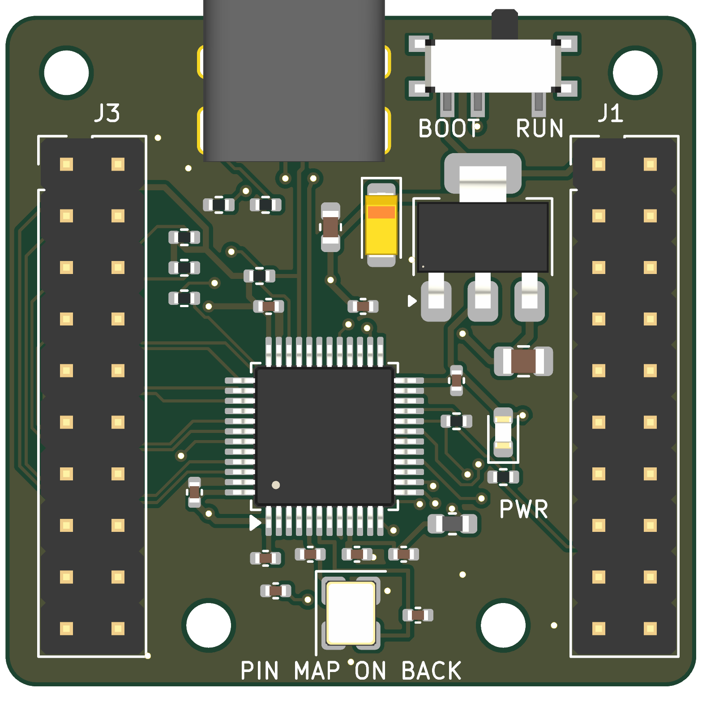
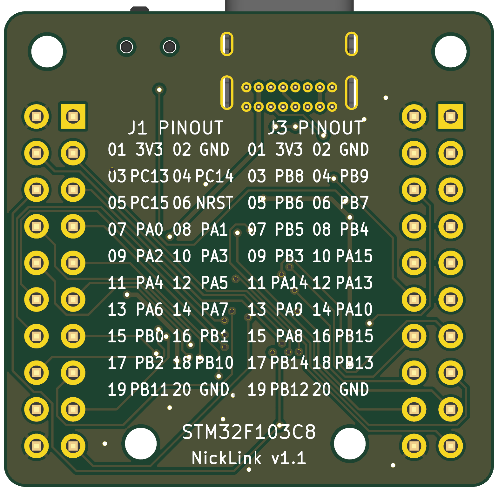

# NickLink v1.1

NickLink is a compact STM32F103C8T6 development and breakout board. Version 1.1 packs the MCU, USB-C connector, regulator, oscillator and support components onto a **34 × 33 mm, two-layer PCB**, with **four M2 mounting holes** and two identical **2×10, 2.54 mm headers for standard Dupont jumper cables**.

## Hardware

- STM32F103C8T6 in LQFP-48, with a 16 MHz crystal.
- USB-C connector for 5 V input and USB full-speed data; separate CC pull-downs support either cable orientation.
- AMS1117-3.3 regulator, power LED, and local supply decoupling.
- BOOT0 slide switch and a BOOT1 pull-down.
- 33 GPIO/interface signals plus reset exposed on the headers, including SWD, UART, SPI, I2C and CAN logic signals.
- Ground pours on both copper layers, with short local ground returns and stitching vias.
- Numbered header pin legends on the back; **NickLink v1.1** on the back silkscreen.

## Layout

The MCU and surrounding components are arranged around their electrical connections. The regulator and capacitors form a close group below the boot switch, the oscillator and analog bypass parts sit below the MCU, and the LED/resistor pair sits together on its right. The lower mounting holes sit inside the header rows.

The board is **48.7% smaller in area than the original 53.5 × 41.7 mm layout**, while keeping the standard header pitch and all four mounting holes.

## Open and edit

Open [`nicklink.kicad_pro`](nicklink.kicad_pro) in **KiCad 10**. The schematic, PCB, project settings and project-local footprint library are included. Standard symbols, footprints and 3D models come from KiCad's libraries; the library tables use KiCad environment variables and relative project paths.

| Location | Contents |
|---|---|
| `nicklink.kicad_sch` | Schematic |
| `nicklink.kicad_pcb` | Routed board and silkscreen |
| `nicklink.kicad_pro` | Design rules and project settings |
| `pcb_hello_world.pretty/` | Project-local USB connector and switch footprints |
| `docs/images/` | Front and back renders |
| `docs/` | Review report, pin mapping, schematic, assembly and copper drawings |
| `fabrication/v1.1/` | Gerbers, drills, BOM and component placement data |
| `checks/` | Saved KiCad DRC/ERC reports |

The historical footprint-library name is retained to preserve existing library references. Local editor state, backup files, router experiments and downloaded tools are excluded from version control.

## Header pinout

**Top view, USB at the top: J3 is left and J1 is right.** Pin 1 is the square pad at the upper left of each header; odd pins run down the left column and even pins down the right. The rear legend gives explicit pin numbers and should not be interpreted as a top-view drawing.

| Pin | J1 | J3 |
|---:|---|---|
| 1 | 3V3 output | 3V3 output |
| 2 | GND | GND |
| 3 | PC13 | PB8 / CAN RX logic |
| 4 | PC14 | PB9 / CAN TX logic |
| 5 | PC15 | PB6 / I2C SCL |
| 6 | NRST | PB7 / I2C SDA |
| 7 | PA0 | PB5 |
| 8 | PA1 | PB4 |
| 9 | PA2 | PB3 |
| 10 | PA3 | PA15 |
| 11 | PA4 | PA14 / SWCLK |
| 12 | PA5 / SPI SCK | PA13 / SWDIO |
| 13 | PA6 / SPI MISO | PA9 / UART TX |
| 14 | PA7 / SPI MOSI | PA10 / UART RX |
| 15 | PB0 | PA8 |
| 16 | PB1 | PB15 |
| 17 | PB2 / BOOT1, 10k pull-down | PB14 |
| 18 | PB10 | PB13 |
| 19 | PB11 | PB12 |
| 20 | GND | GND |

For SWD, connect J3.11 (clock), J3.12 (data), J3.1 (target voltage sense), and GND. Reset is J1.6. The 3V3 header pins are regulator outputs when USB powers the board; do not attach another powered 3V3 source at the same time.

## Mounting

All four mounting holes have 2.2 mm drills for M2 fasteners. Coordinates are measured from the upper-left corner of the outline's bounding rectangle, viewed from the top, with X right and Y down.

| Hole | X (mm) | Y (mm) |
|---|---:|---:|
| H1 | 3.02 | 2.83 |
| H2 | 31.02 | 2.83 |
| H3 | 10.03 | 30.02 |
| H4 | 24.52 | 30.02 |

Use the current PCB and drill files for enclosure design. Hole positions and connector locations differ from earlier layouts.

## Validation and fabrication

The final board is checked with KiCad 10: **0 DRC violations, 0 unconnected items, 0 schematic parity issues, and 0 ERC violations.** See the saved reports in [`checks/`](checks/) and the detailed [design review](docs/REVIEW.md). Automated checks establish connectivity and geometric clearance; this revision still needs an assembled prototype and electrical testing.

Before ordering assembly:

- Select exact C12, C13 and Y1 parts. C13 is a **polarized 22 µF tantalum capacitor**; pad 1 is positive. Verify its ESR against the actual AMS1117 manufacturer's requirements. Confirm the crystal's load capacitance against the fitted 10 pF capacitors.
- Check assembler rotations, BOM choices and footprint orientation against the assembly drawing. Historical supplier IDs are marked unvalidated.
- Review regulator temperature, USB current and the intended external load. The regulator's headline rating is not an established available header current.

For bring-up:

1. Check for shorts, then apply current-limited 5 V and verify 3V3 and VDDA.
2. Connect SWD, verify reset, and configure firmware for the **16 MHz HSE** and a valid **48 MHz USB clock**. No working firmware is included.
3. Verify oscillator startup and USB enumeration in both cable orientations.
4. Test the required peripheral interfaces.

**Interface limits:** USB and CAN cannot operate simultaneously on this STM32F103 because they share packet RAM. CAN header signals require an external CAN transceiver and the appropriate pin remap. BOOT selects the factory USART1 bootloader, not a factory USB DFU bootloader. No external USB ESD protection, USB current limiter or reverse-power protection is fitted. USB impedance and compliance have not been qualified against a fabrication stackup.

## References

- [ST STM32F103x8/xB datasheet](https://www.st.com/resource/en/datasheet/stm32f103c8.pdf)
- [ST AN2586 — hardware design](https://www.st.com/resource/en/application_note/an2586-getting-started-with-stm32f10xxx-hardware-development-stmicroelectronics.pdf)
- [C&K PCM switch datasheet](https://www.ckswitches.com/media/1424/pcm.pdf)

No license has been specified for this repository.
