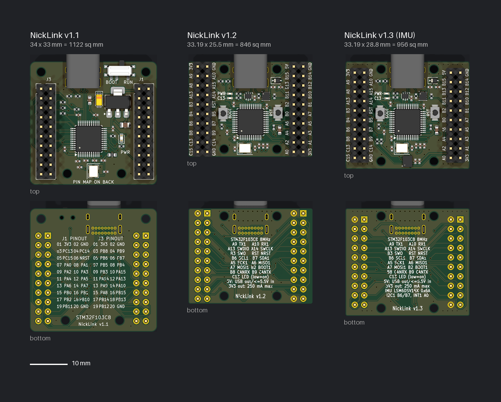

# NickLink v1.2

NickLink is a compact STM32F103C8T6 development and breakout board. Version 1.2 is a **33.2 × 25.5 mm, two-layer PCB**, the same height as its two **2×10, 2.54 mm headers**, with **four M2 mounting holes**, USB-C, RESET and BOOT buttons, a user LED, and **every header pin labelled on the front silkscreen**.

## What changed from v1.1

| | v1.1 | v1.2 |
|---|---|---|
| Outline | 34 × 33 mm (1122 mm²) | **33.19 × 25.5 mm (846 mm², −25%)** |
| Pin labels | Numbered table on the back | **Name beside every pin on the front**; function cheat sheet on the back |
| 5 V on the headers | None | **J1.1 = 5 V** (USB VBUS through a Schottky; also a 5 V input) |
| Reset | Header pin only | **RESET button** + NRST on J3 next to SWD |
| Boot | BOOT0 slide switch | **BOOT button** (hold BOOT, tap RESET) |
| SWD | Split across J1 and J3 | **All on J3**: 3V3, GND, SWDIO, SWCLK, SWO, NRST |
| HSE crystal | 16 MHz | **8 MHz** (matches Blue Pill / STM32duino / CubeMX defaults) |
| Regulator | AMS1117-3.3 (SOT-223) + 22 µF tantalum | **TLV75533** (2×2 mm WSON) + ceramics |
| USB ESD | None | **USBLC6-2P6** on D+/D− and VBUS |
| I2C pull-ups | 1.5 kΩ fitted on PB6/PB7 | Removed (most modules have their own); PB6/PB7 are free GPIO |
| LEDs | Power | Power + **user LED on PC13** (low = on) |

## Hardware

- STM32F103C8T6 (LQFP-48) with an 8 MHz crystal (12 pF load, 15 pF C0G caps): PLL ×9 = 72 MHz, USB clock 72 / 1.5 = 48 MHz.
- USB-C (GCT USB4085, through-hole) for power and USB full speed; 5.1 kΩ CC pull-downs for either orientation; 1.5 kΩ D+ pull-up; USBLC6-2P6 ESD array.
- Power path: USB VBUS → 1N5819WS Schottky → **5V rail** (J1.1) → TLV75533 LDO → **3V3** (J3.1, J1.20). The Schottky stops a supply on the 5V pin from back-feeding the USB host.
- RESET button (NRST to GND, 100 nF), BOOT button (BOOT0 to 3V3, 10 kΩ pull-down), 10 kΩ pull-down on PB2/BOOT1.
- Red power LED, green user LED on PC13 (active low).
- 33 GPIO + NRST on the headers. Only PA11/PA12 (USB) and PD0/PD1 (crystal) are not broken out.
- GND pours on both layers, stitched with vias.

## Header pinout

**Top view, USB at the top: J3 is left, J1 is right.** Pin 1 is the square pad at the upper left of each header; odd pins are the left column. The front silkscreen prints each pin's name right beside it (`A9` = PA9, `B12` = PB12, `RST` = NRST).

| Pin | J3 (left) | J1 (right) |
|---:|---|---|
| 1 | `3V3` 3V3 regulated output | `5V` 5 V (USB VBUS after Schottky; ≤5.5 V input) |
| 2 | `GND` | `GND` |
| 3 | `A9` PA9 / UART1 TX | `B15` PB15 / SPI2 MOSI |
| 4 | `A10` PA10 / UART1 RX | `B14` PB14 / SPI2 MISO |
| 5 | `A8` PA8 | `B13` PB13 / SPI2 SCK |
| 6 | `A15` PA15 | `B12` PB12 |
| 7 | `A13` PA13 / SWDIO | `B11` PB11 / I2C2 SDA / UART3 RX |
| 8 | `A14` PA14 / SWCLK | `B10` PB10 / I2C2 SCL / UART3 TX |
| 9 | `B3` PB3 / SWO | `B2` PB2 / BOOT1, 10k pull-down |
| 10 | `RST` NRST (reset, active low) | `B1` PB1 (3.3 V only) |
| 11 | `B4` PB4 | `B0` PB0 (3.3 V only) |
| 12 | `B5` PB5 (3.3 V only) | `A7` PA7 / SPI1 MOSI (3.3 V only) |
| 13 | `B6` PB6 / I2C1 SCL | `A6` PA6 / SPI1 MISO (3.3 V only) |
| 14 | `B7` PB7 / I2C1 SDA | `A5` PA5 / SPI1 SCK (3.3 V only) |
| 15 | `B8` PB8 / CAN RX (remap) | `A4` PA4 (3.3 V only) |
| 16 | `B9` PB9 / CAN TX (remap) | `A3` PA3 / UART2 RX (3.3 V only) |
| 17 | `C13` PC13 / user LED (3.3 V only) | `A2` PA2 / UART2 TX (3.3 V only) |
| 18 | `C14` PC14 (3.3 V only) | `A1` PA1 (3.3 V only) |
| 19 | `C15` PC15 (3.3 V only) | `A0` PA0 / WKUP (3.3 V only) |
| 20 | `GND` | `3V3` 3V3 regulated output |

Pins not marked "3.3 V only" are 5 V tolerant (FT) while the board is powered. PA0–PA7, PB0 and PB1 are also ADC inputs. [`docs/pinout.csv`](docs/pinout.csv) has the same table in machine-readable form.

- **SWD:** J3.1 3V3 (target voltage sense), J3.2 GND, J3.7 SWDIO, J3.8 SWCLK, J3.10 NRST, optional J3.9 SWO.
- **Serial bootloader:** hold BOOT, tap RESET, release BOOT, then use USART1 on J3.3 (TX) / J3.4 (RX). This is ST's factory USART bootloader; the F103 has no factory USB DFU bootloader.
- **User LED:** PC13 low turns it on. PC13–PC15 are low-drive pins (sink ≤3 mA, ≤2 MHz) and must not source current.

## Power

- **5V pin (J1.1):** USB VBUS minus about 0.3–0.4 V when USB powers the board. It can also power the board: apply 4.5–5.5 V there. **Do not exceed 5.5 V**; the regulator's absolute maximum is 6 V. The Schottky carries at most about 400 mA (thermal limit).
- **3V3 pins (J3.1, J1.20):** LDO outputs. Budget about **250 mA total including the MCU**. That figure is an estimate for this two-layer board, not a measured limit. **Do not feed 3V3 in from outside**: the TLV755 has no reverse-current protection.

## Mounting

Four 2.2 mm holes for M2 screws. The keep-out is sized for **button-head (ISO 7380, 3.5 mm head)** screws and standoffs up to 4 mm across. Coordinates are measured from the board's upper-left corner, top view, X right, Y down.

| Hole | X (mm) | Y (mm) |
|---|---:|---:|
| H1 | 9.53 | 2.05 |
| H2 | 23.66 | 2.05 |
| H3 | 9.53 | 23.45 |
| H4 | 23.66 | 23.45 |

The USB-C receptacle overhangs the top edge by about 2 mm, as in v1.1.

## Open and edit

Open [`nicklink.kicad_pro`](nicklink.kicad_pro) in **KiCad 10**. The schematic, PCB, rules and project-local footprints (`nicklink.pretty/`) are included.

v1.2 is generated by scripts in [`tools/`](tools/README.md). [`tools/spec.py`](tools/spec.py) is the single source of truth for parts, nets and header pinout, and [`tools/placement.py`](tools/placement.py) holds component positions. `tools/build_all.sh` regenerates the schematic, places parts, autoroutes with Freerouting, stitches the GND pours and runs DRC. It writes `nicklink.kicad_pcb` only if everything is clean. Everything runs in Docker (`kicad/kicad:10.0`); no local KiCad install is needed.

| Location | Contents |
|---|---|
| `nicklink.kicad_sch` / `.kicad_pcb` / `.kicad_pro` | Generated schematic, routed board, design rules |
| `nicklink.pretty/` | Project footprints: USB4085, plus header and button copies without silkscreen (the board draws its own labels) |
| `tools/` | Build pipeline, see [tools/README.md](tools/README.md) |
| `docs/` | [Design review](docs/REVIEW.md), pinout CSV, schematic, assembly and copper PDFs, renders |
| `fabrication/v1.2/` | Gerbers, drills, JLC BOM and CPL |
| `fabrication/v1.1/` | Previous revision's outputs, kept for reference |
| `checks/` | Saved DRC/ERC reports for v1.2 |

## Validation and fabrication

KiCad 10.0.6: **0 DRC violations, 0 unconnected items, 0 schematic-parity issues, 0 ERC errors or warnings** (reports in [`checks/`](checks/)). Every pin in the schematic netlist is checked against `tools/spec.py`. These checks cover connectivity and geometry. This revision has not been built yet; it needs a prototype and bench testing.

The BOM carries verified LCSC part numbers for JLCPCB SMD assembly. The USB-C connector and pin headers are through-hole parts to hand-solder. Several parts are JLC "Extended" parts, which add a per-part loading fee; see [`tools/parts_research.md`](tools/parts_research.md).

Bring-up:

1. Check for shorts, then apply current-limited 5 V and verify 5V (≈4.7 V on USB), 3V3 and VDDA.
2. Connect SWD and confirm the RESET button resets the chip.
3. Configure firmware for the **8 MHz HSE**: PLL ×9 = 72 MHz, USB prescaler /1.5. Verify that the oscillator starts. If the HSE runs fast, try 18 pF load capacitors.
4. Check USB enumeration in both cable orientations, then BOOT + RESET into the USART1 bootloader.
5. Test the peripherals you need.

**Interface limits:**

- USB and CAN cannot run at the same time on the F103 (they share packet RAM).
- CAN uses PB8/PB9 through the remap and needs an external transceiver.
- USB impedance and compliance are not qualified.

## References

- [ST STM32F103x8/xB datasheet](https://www.st.com/resource/en/datasheet/stm32f103c8.pdf)
- [ST AN2586 — hardware design](https://www.st.com/resource/en/application_note/an2586-getting-started-with-stm32f10xxx-hardware-development-stmicroelectronics.pdf)
- [ST AN2867 — oscillator design](https://www.st.com/resource/en/application_note/an2867-guidelines-for-oscillator-design-on-stm8afals-and-stm32-mcusmpus-stmicroelectronics.pdf)
- [TI TLV755P datasheet](https://www.ti.com/lit/ds/symlink/tlv755p.pdf)
- [ST USBLC6-2 datasheet](https://www.st.com/resource/en/datasheet/usblc6-2.pdf)

Licensed under the [MIT License](LICENSE).
