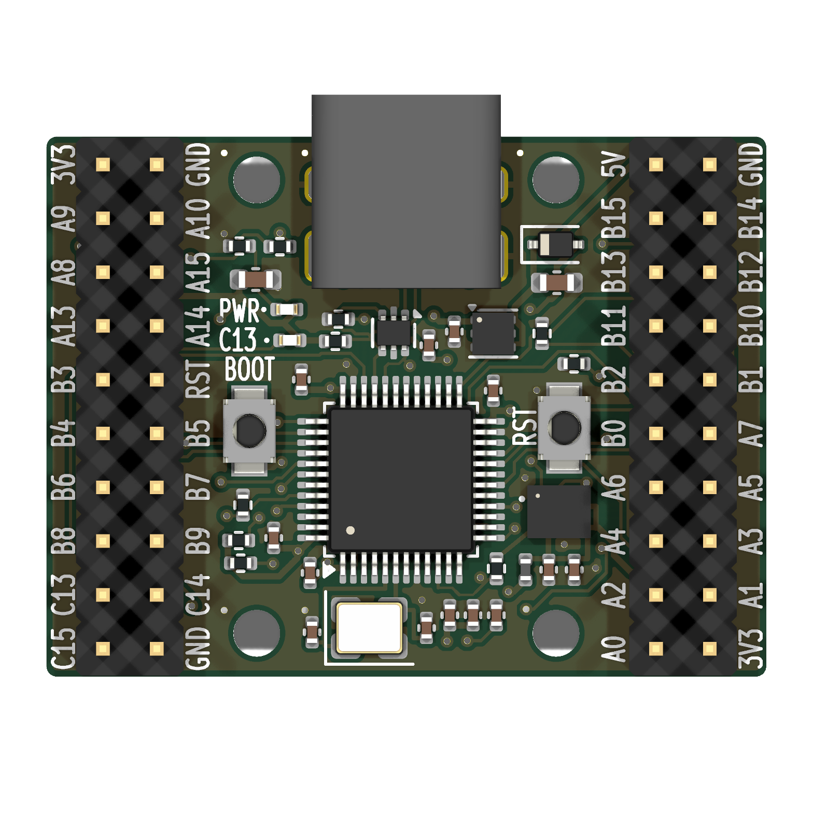
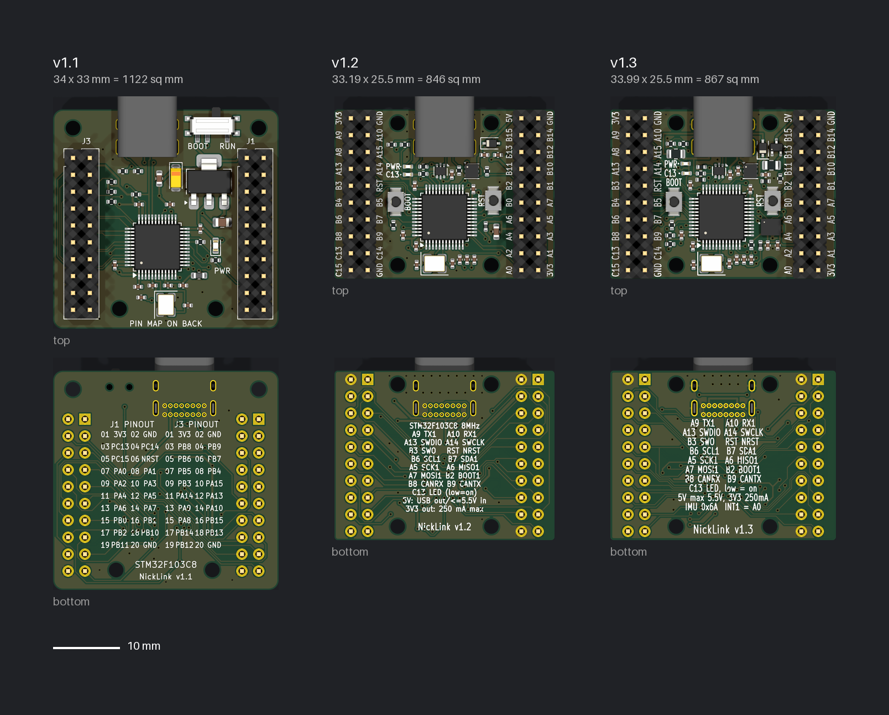
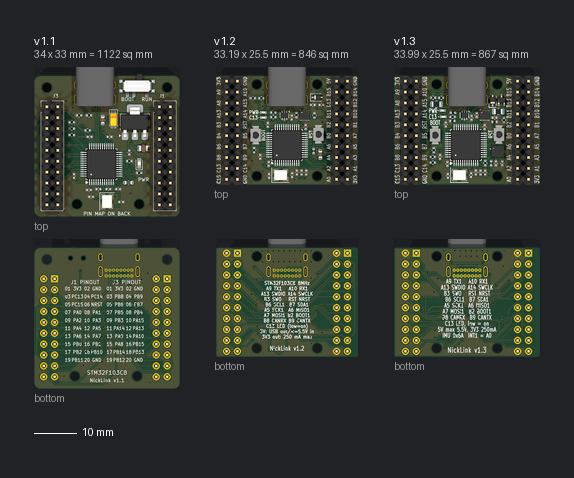

# NickLink v1.3

NickLink is a compact STM32F103C8T6 development and breakout board. Version 1.3 is a **34.0 × 25.5 mm, two-layer PCB** with an on-board **6-axis IMU (ST LSM6DSV16X)** for motion tracking, robotics and tap-to-wake projects. It also has two **2×10, 2.54 mm headers**, **four M2 mounting holes**, USB-C, RESET and BOOT buttons, a user LED, and **every header pin labelled on the front silkscreen**.

True size on a 27-inch 1440p monitor (view at 100% zoom)

## What changed

**v1.3** adds the IMU on I2C1. It fits into existing gaps beside the MCU, on the top side with single-sided assembly. The board is 0.8 mm wider than v1.2 only because the pin labels grew to JLC's 1.0 mm minimum text height (see [JLCPCB design rules](#jlcpcb-design-rules)). PB6/PB7 get 4.7 kΩ pull-ups again, because the bus now has an on-board device. The IMU's INT1 drives PA0. The 3V3 budget drops by about 1 mA for the IMU. Everything else is as in v1.2.

**v1.3 reliability pass** (from a five-reviewer audit, the SPICE benches in [`sim/`](sim/) and ST's AN2586/AN4879 checklists):

- **Hot-plug damping:** R12, 1 Ω in series with VBUS, keeps the cable ring under the LDO's 6 V absolute maximum and inrush under 50 µC.
- **Protected 5V pin:** J1.1 now has a 0.5 A polyfuse (F1) and a reverse-polarity P-MOSFET (Q1), so a short or a reversed supply no longer reaches VSYS unprotected.
- **D+ pull-up from VBUS** (AN4879 §3.1.1): it is present only while USB is plugged in. Powering from J1.1 no longer back-feeds the host.
- **Decoupling:** C4 at VDD3 is now 4.7 µF, as DS5319 requires. C12 (LDO input) is 4.7 µF, to keep inrush down.
- **User LED:** R6 is 330 Ω: about 1.3 mA instead of 0.4 mA, still within PC13's 3 mA sink limit.
- **Routing:** locked tracks for the USB-C orientation ties and the IMU's 3V3 feed. Every GND pad and pour island is checked for connection.

**Revision comparison:**

| | v1.1 | v1.2 | v1.3 |
|---|---|---|---|
| Outline | 34 × 33 mm (1122 mm²) | **33.19 × 25.5 mm** (846 mm², −25%) | **33.99 × 25.5 mm** (867 mm², −23%) |
| Pin labels | Numbered table on the back | **Name beside every pin on the front**; cheat sheet on the back | Same; 1.0 mm text (JLC minimum) |
| 5 V on the headers | None | **J1.1 = 5 V** (USB VBUS through a Schottky; also a 5 V input) | Same, plus a **0.5 A polyfuse and reverse-polarity protection** |
| USB power path | VBUS straight to the regulator | Schottky | **1 Ω hot-plug damping** + Schottky |
| Regulator | AMS1117-3.3 (SOT-223) + 22 µF tantalum | **TLV75533** (2×2 mm WSON) + ceramics | **TLV76733**, same package, input rated to 18 V |
| Reset | Header pin only | **RESET button** + NRST on J3 next to SWD | Same |
| Boot | BOOT0 slide switch | **BOOT button** (hold BOOT, tap RESET) | Same |
| SWD | Split across J1 and J3 | **All on J3**: 3V3, GND, SWDIO, SWCLK, SWO, NRST | Same |
| HSE crystal | 16 MHz | **8 MHz** (matches Blue Pill / STM32duino / CubeMX defaults) | Same |
| USB D+ pull-up | 1.5 kΩ to 3V3 | 1.5 kΩ to 3V3 | **From VBUS** (2.2k/4.7k), so no back-feed when powered from J1.1 |
| USB ESD | None | **USBLC6-2P6** on D+/D− and VBUS | Same |
| I2C pull-ups | 1.5 kΩ fitted on PB6/PB7 | Removed | **4.7 kΩ** (needed by the on-board IMU) |
| LEDs | Power | Power + **user LED on PC13** (low = on) | Same, brighter (330 Ω, about 1.3 mA) |
| IMU | — | — | **LSM6DSV16X** 6-axis accel + gyro with on-chip sensor fusion |
| Verification | — | DRC/ERC | DRC/ERC, SPICE benches ([`sim/`](sim/)), emulated test firmware ([`firmware/`](firmware/)) |

## Hardware

- STM32F103C8T6 (LQFP-48) with an 8 MHz crystal (12 pF load, 15 pF C0G caps): PLL ×9 = 72 MHz, USB clock 72 / 1.5 = 48 MHz.
- USB-C (GCT USB4085, through-hole) for power and USB full speed; 5.1 kΩ CC pull-downs for either orientation; D+ pull-up from VBUS (2.2 kΩ / 4.7 kΩ divider, 1.5 kΩ to 3.4 V, so it is present only while USB is plugged in); USBLC6-2P6 ESD array.
- Power path: USB VBUS → R12 1 Ω (hot-plug damping) → 1N5819WS Schottky → **VSYS** → TLV76733 LDO → **3V3** (J3.1, J1.20). VSYS also reaches the **5V pin** (J1.1) through a 0.5 A polyfuse (F1) and a reverse-polarity P-MOSFET (Q1). The Schottky stops a supply on the 5V pin from back-feeding the USB host.
- RESET button (NRST to GND, 100 nF), BOOT button (BOOT0 to 3V3, 10 kΩ pull-down), 10 kΩ pull-down on PB2/BOOT1.
- Red power LED, green user LED on PC13 (active low).
- **IMU:** ST LSM6DSV16X 6-axis accelerometer and gyroscope on I2C1 (PB6 SCL / PB7 SDA, address **0x6A**), INT1 to PA0.
- 33 GPIO + NRST on the headers. Only PA11/PA12 (USB) and PD0/PD1 (crystal) are not broken out.
- GND pours on both layers, stitched with vias.

## Header pinout

**Top view, USB at the top: J3 is left, J1 is right.** Pin 1 is the square pad at the upper left of each header; odd pins are the left column. The front silkscreen prints each pin's name right beside it (`A9` = PA9, `B12` = PB12, `RST` = NRST).

| Pin | J3 (left) | J1 (right) |
|---:|---|---|
| 1 | `3V3` 3V3 regulated output | `5V` 5 V (USB VBUS through Schottky + 0.5 A polyfuse; 4.5–5.5 V input, reverse-polarity protected) |
| 2 | `GND` | `GND` |
| 3 | `A9` PA9 / UART1 TX | `B15` PB15 / SPI2 MOSI |
| 4 | `A10` PA10 / UART1 RX | `B14` PB14 / SPI2 MISO |
| 5 | `A8` PA8 | `B13` PB13 / SPI2 SCK |
| 6 | `A15` PA15 | `B12` PB12 |
| 7 | `A13` PA13 / SWDIO | `B11` PB11 / I2C2 SDA / UART3 RX |
| 8 | `A14` PA14 / SWCLK | `B10` PB10 / I2C2 SCL / UART3 TX |
| 9 | `B3` PB3 / SWO | `B2` PB2 / BOOT1, 10k pull-down |
| 10 | `RST` NRST (reset, active low; 3.3 V only) | `B1` PB1 (3.3 V only) |
| 11 | `B4` PB4 | `B0` PB0 (3.3 V only) |
| 12 | `B5` PB5 (3.3 V only) | `A7` PA7 / SPI1 MOSI (3.3 V only) |
| 13 | `B6` PB6 / I2C1 SCL (4.7k pull-up, IMU; 3.3 V only) | `A6` PA6 / SPI1 MISO (3.3 V only) |
| 14 | `B7` PB7 / I2C1 SDA (4.7k pull-up, IMU; 3.3 V only) | `A5` PA5 / SPI1 SCK (3.3 V only) |
| 15 | `B8` PB8 / CAN RX (remap) | `A4` PA4 (3.3 V only) |
| 16 | `B9` PB9 / CAN TX (remap) | `A3` PA3 / UART2 RX (3.3 V only) |
| 17 | `C13` PC13 / user LED (3.3 V only) | `A2` PA2 / UART2 TX (3.3 V only) |
| 18 | `C14` PC14 (3.3 V only) | `A1` PA1 (3.3 V only) |
| 19 | `C15` PC15 (3.3 V only) | `A0` PA0 / WKUP / IMU INT1 via 10k (3.3 V only) |
| 20 | `GND` | `3V3` 3V3 regulated output |

Pins not marked "3.3 V only" are 5 V tolerant (FT) while the board is powered. B6/B7 are FT on the MCU but not at board level, because the IMU on that bus is limited to 3.6 V. PA1–PA7, PB0 and PB1 are also ADC inputs. PA0 is too, but it has the IMU interrupt on it (below). [`docs/pinout.csv`](docs/pinout.csv) has the same table in machine-readable form.

- **SWD:** J3.1 3V3 (target voltage sense), J3.2 GND, J3.7 SWDIO, J3.8 SWCLK, J3.10 NRST, optional J3.9 SWO.
- **Serial bootloader:** hold BOOT, tap RESET, release BOOT, then use USART1 on J3.3 (TX) / J3.4 (RX). This is ST's factory USART bootloader; the F103 has no factory USB DFU bootloader.
- **I2C1 / IMU:** I2C1 has on-board 4.7 kΩ pull-ups. External I2C modules can share the bus as long as they avoid address 0x6A and **pull up to 3.3 V only**. A 5 V module needs a level shifter, because the IMU's SCL/SDA limit is 3.6 V. If modules bring their own pull-ups, keep the combined value above about 1.5 kΩ. The 4.7 kΩ pull-ups meet the 400 kHz rise-time limit up to about 75 pF of bus capacitance (roughly 30 cm of wiring plus a few modules); for longer runs, use 100 kHz.
- **A0 has the IMU's INT1 on it through 10 kΩ.** INT1 drives low whenever no interrupt is asserted, so A0 always sees a 10 kΩ pull-down (also with INT1 set to open-drain, which only releases the pin while active-high). The interrupt is active high, matching WKUP's rising edge. You can still drive A0 from outside, or use it as an ADC input from a low-impedance source. Making A0 truly high-impedance needs INT1 set active-low open-drain (`H_LACTIVE` + `PP_OD`, IF_CFG 03h), which inverts the interrupt and stops it from waking the MCU through WKUP.
- **J3.6/J3.9/J3.11 (PA15/PB3/PB4) are JTAG pins at reset:** PA15 and PB4 have internal pull-ups and PB3 (JTDO/SWO) has none, until firmware frees them (`__HAL_AFIO_REMAP_SWJ_NOJTAG()` keeps SWD and releases them). PA13/PA14 stay SWD unless you disable SWJ completely, after which the debugger has to connect under reset (NRST is on J3.10).
- **User LED:** PC13 low turns it on. PC13–PC15 are low-drive pins (≤2 MHz) and must not source current. Their 3 mA sink limit is shared by all three pins (DS5319 Table 5), and the LED already takes about 1.3–1.8 mA of it. J3.17 carries the LED load, so an undriven PC13 floats around 1–1.5 V.

## IMU

The LSM6DSV16X is a 6-axis IMU: accelerometer up to ±16 g, gyroscope up to ±4000 dps.
- **Address:** I2C1 at 0x6A (SA0 tied low); CS is tied high for I2C mode.
- **Interrupt:** INT1 goes to PA0. PA0 is also the STM32's WKUP pin, so a tap or motion interrupt (rising edge) can wake the MCU from Standby.

Features useful here:
- **On-chip sensor fusion (SFLP):** outputs a game rotation vector (quaternion) at 15–480 Hz through the FIFO. The F103 has no hardware floating point, so this saves it doing the orientation math.
- **Hardware event detection:** tap, double-tap, wake-up, free-fall and 6D-orientation events, routable to INT1 (MD1_CFG 5Eh, with INTERRUPTS_ENABLE set in FUNCTIONS_ENABLE 50h). This covers tap-activated projects without polling.

Firmware starting points: ST's `lsm6dsv16x-pid` platform-independent driver and the STM32duino `STM32duino-LSM6DSV16X` library. Bring-up check: WHO_AM_I (0Fh) should read **0x70**.

Placement follows ST's LGA guidance: the IMU sits on the top side, with no ground pour or vias under the package, and only short pad-to-pad links at its edges. The local wiring is pre-routed; see docs/REVIEW.md. It sits in the right channel beside the MCU, below the RESET button, away from the regulator's heat and USB cable strain. ST's guidance of about 10 mm from screws (in its MEMS layout notes) can't be met on a board this small; H4 is about 2.4 mm from the IMU body. Mount on standoffs without over-tightening, since board flex shows up as accelerometer offset.

## Power

- **5V pin (J1.1), as an output:** VSYS through F1 (0.5 A hold, 1 A trip) and Q1. On USB that is VBUS minus the drop across R12, D2, F1 and Q1:
  - About 4.7 V at light load.
  - 4.2–4.4 V with 200 mA drawn from J1.1, from a 5.0 V port. From a 4.75 V port it is 4.0–4.1 V, so 5 V modules that need at least 4.5 V may not run.
  - A short from J1.1 to the adjacent GND pin trips F1 in about 0.1 s. VSYS collapses meanwhile, so the MCU resets once; the board recovers when the short is removed.
  - F1's hold current falls to about 0.33 A at 60 °C.
- **5V pin (J1.1), as an input:** apply 4.5–5.5 V and **do not exceed 5.5 V** in steady state. The parts behind it are rated higher (regulator 18 V, C12 and F1 16 V, Q1 gate ±12 V), so plug-in overshoot is survivable with normal leads. Q1 blocks a reversed supply, and F1 limits the current. D2 keeps J1.1 from back-feeding the USB host. With USB unplugged, the D+ pull-up is unpowered, so the host sees no device until USB is connected. Don't connect a battery to J1.1 while USB is plugged in: USB would charge it through F1 and Q1.
- **3V3 pins (J3.1, J1.20):** LDO outputs. Budget about **250 mA total including the MCU** when powered from USB. That figure is an estimate for this two-layer board (with two thermal vias under the LDO), not a measured limit. From a 5.5 V input on J1.1, keep below about 200 mA. **Do not feed 3V3 in from outside**: the regulator isn't specified for reverse current.
- **Hot-plug:** cables ring when plugged into a live supply. SPICE (`sim/` benches 11 and 12):
  - **USB:** with R12 fitted, the worst-case regulator input peak is 5.38 V for cables up to 1 µH (6.1–11.4 V without R12), and 7.3 V for an unusually long 3 µH cable. Inrush is 33 µC (USB limit 50 µC). R12 costs about 0.25 V of headroom at 250 mA.
  - **J1.1:** this path has no R12, so plugging a live supply onto J1.1 rings VSYS to about 5.4–9 V. That is why the regulator is the 18 V TLV76733.
  - **Bench leads over about 1 µH:** with these on J1.1, connect first and then switch the supply on. The most pessimistic capacitor model puts the ring past Q1's 12 V gate rating.

## Mounting

Four 2.2 mm holes for M2 screws. The keep-out is sized for **button-head (ISO 7380, 3.5 mm head)** screws and standoffs up to 4 mm across. Coordinates are measured from the board's upper-left corner, top view, X right, Y down.

| Hole | X (mm) | Y (mm) |
|---|---:|---:|
| H1 | 9.93 | 2.05 |
| H2 | 24.06 | 2.05 |
| H3 | 9.93 | 23.45 |
| H4 | 24.06 | 23.45 |

The USB-C receptacle overhangs the top edge by about 2 mm, as in v1.1.

## Open and edit

Open [`nicklink.kicad_pro`](nicklink.kicad_pro) in **KiCad 10**. The schematic, PCB, rules and project-local footprints (`nicklink.pretty/`) are included.

NickLink is generated by scripts in [`tools/`](tools/README.md). [`tools/spec.py`](tools/spec.py) is the single source of truth for parts, nets and header pinout, and [`tools/placement.py`](tools/placement.py) holds component positions. `tools/build_all.sh` regenerates the schematic, places parts, autoroutes with Freerouting, stitches the GND pours and runs DRC. It writes `nicklink.kicad_pcb` only if everything is clean. Everything runs in Docker (`kicad/kicad:10.0`); no local KiCad install is needed.

| Location | Contents |
|---|---|
| `nicklink.kicad_sch` / `.kicad_pcb` / `.kicad_pro` | Generated schematic, routed board, design rules |
| `nicklink.pretty/` | Project footprints: USB4085, plus header and button copies without silkscreen (the board draws its own labels) |
| `tools/` | Build pipeline, see [tools/README.md](tools/README.md) |
| `docs/` | [Design review](docs/REVIEW.md), pinout CSV, schematic, assembly and copper PDFs, renders |
| `fabrication/v1.3/` | Gerbers, drills, JLC BOM and CPL |
| `fabrication/v1.1/`, `v1.2/` | Previous revisions' outputs, kept for reference |
| `checks/` | Saved DRC/ERC reports for v1.3 |

## JLCPCB design rules

The board is checked against JLCPCB's published 2-layer and assembly limits ([PCB capabilities](https://jlcpcb.com/capabilities/pcb-capabilities), [assembly capabilities](https://jlcpcb.com/capabilities/pcb-assembly-capabilities), checked 2026-10-01). The limits are encoded in the board setup and `nicklink.kicad_dru`, so every DRC run enforces them.

| JLC limit | NickLink |
|---|---|
| Trace / space ≥ 0.10 / 0.10 mm | ≥ 0.10 mm tracks (0.127 mm signals, 0.2 mm GND and 3V3, 0.3 mm VBUS/5 V), 0.127 mm clearance |
| Via ≥ 0.15 mm drill / 0.25 mm diameter | 0.3 / 0.6 mm |
| Component PTH annular ring ≥ 0.18 mm | ≥ 0.18 mm. The USB4085 pads change from GCT's 0.40/0.65 mm (0.125 mm ring) to a 0.38 mm hole in a 0.74 mm pad, which stays within GCT's 0.40 ± 0.05 mm hole spec for the 0.22 × 0.15 mm pins. The pad gap is 0.11 mm, above JLC's 0.10 mm. The LDO's two thermal vias are 0.3 mm in 0.66 mm pads. |
| Pad hole-to-hole ≥ 0.45 mm; plated slot ≥ 0.5 mm | ≥ 0.47 mm (USB4085 0.85 mm pitch, 0.38 mm holes); 0.6 mm shield slots |
| SMD pad to pad ≥ 0.15 mm | ≥ 0.15 mm (the IMU's LGA is the tightest) |
| Copper to routed edge ≥ 0.2 mm (≥ 0.3 mm for Economic assembly) | 0.3 mm |
| Solder-mask web ≥ 0.10 mm | 0.10 mm minimum checked |
| Silkscreen line ≥ 0.15 mm, text ≥ 1.0 mm, silk to pad ≥ 0.15 mm | All silk ≥ 0.15 mm wide; labels 1.0 mm tall; labels 0.15 mm from pads and the edge. The library 0402 footprints' own silk sits about 0.09 mm from their pads; JLC clips it. |
| Component bodies ≥ 0.3 mm apart, IPC-7351B medium density | KiCad library courtyards (IPC nominal), none overlapping |
| Economic assembly: components ≥ 0.3 mm from edge, pitch ≥ 0.4 mm, passives ≥ 0201 | SMD bodies ≥ 1 mm from the edge; finest pitch 0.5 mm; 0402 passives |

**Ordering:**
- Under 70 × 70 mm, so order **Economic PCBA**. Economic needs no on-board fiducials or rails. JLC can add edge rails and fiducials if you choose Standard or panelize; on-board fiducials would need 3.85 mm from the edge.
- Choose an **ENIG** finish: the 0.5 mm-pitch LGA and LQFP solder more reliably on a flat pad than on HASL.
- The CPL rotations are corrected for JLC's footprints (`JLC_ROT` in `tools/fab.sh`: LQFP-48 −90°; SOT-666, LGA-14 and SOT-323 +180°). Still check the pin-1 marks in JLC's placement preview.
- The through-hole parts (USB-C, headers) are hand-soldered. The USB-C GND pins use thermal reliefs to make that easier.
- Signal tracks, and VBUS_D (USB power) under H1, pass under the M2 screw heads (under solder mask, vias tented). Use plastic standoffs or washers if you clamp with metal hardware.

## Validation and fabrication

KiCad 10.0.6: **0 DRC violations, 0 unconnected items, 0 schematic-parity issues, 0 ERC errors or warnings** (reports in [`checks/`](checks/)). Every pin in the schematic netlist is checked against `tools/spec.py`. These checks cover connectivity and geometry. This revision has not been built yet; it needs a prototype and bench testing.

The BOM carries verified LCSC part numbers for JLCPCB SMD assembly. To order, upload `fabrication/v1.3/nicklink_gerbers.zip`, then for assembly `nicklink_BOM_JLC.csv` (SMD parts only) and `nicklink_CPL.csv`. The USB-C connector and pin headers are through-hole parts to hand-solder. Several parts are JLC "Extended" parts, which add a per-part loading fee; see [`tools/parts_research.md`](tools/parts_research.md).

Bring-up:

1. Check for shorts, then apply current-limited 5 V and verify 5V (≈4.7 V on USB at light load), 3V3 and VDDA.
2. Connect SWD and confirm the RESET button resets the chip.
3. Configure firmware for the **8 MHz HSE**: PLL ×9 = 72 MHz, USB prescaler /1.5. Verify that the oscillator starts. If the HSE runs fast, try 18 pF load capacitors.
4. Check USB enumeration in both cable orientations, then BOOT + RESET into the USART1 bootloader.
5. Scan I2C1 (expect 0x6A) and read IMU WHO_AM_I = 0x70. Tap the board and check that A0 pulses once tap detection is enabled.
6. Test the peripherals you need.

**Interface limits:**

- USB and CAN cannot run at the same time on the F103 (they share packet RAM).
- **I2C1 is always in use by the IMU (PB6/PB7).**
  - Remapping SPI1 to PA15/PB3/PB4/PB5 while I2C1 is clocked breaks MOSI on PB5 (erratum ES096). Gate the I2C1 clock off while SPI1 is remapped.
  - Using PB6/PB7 for USART1-remap or TIM4 disturbs the IMU's bus.
  - Remapping I2C1 to PB8/PB9 disconnects the IMU and takes the CAN pins.
- **Never set the IMU's `IF_CFG.I2C_I3C_disable` bit.** With CS tied high and no power switch on the IMU, only a full power cycle recovers it.
- CAN uses PB8/PB9 through the remap and needs an external transceiver.
- USB impedance and compliance are not qualified.

**Firmware notes for reliability:**

- The F103 has power-on/power-down reset but **no brown-out reset**. Enable the PVD (for example at 2.9 V) and stop flash writes when it trips.
- Enable the clock security system (CSS). If the HSE fails, the MCU falls back to HSI. USB cannot run from HSI, so treat that as a fault.
- Do not drive header pins while the board is unpowered. Keep injected current within ±5 mA per pin; PA4, PA5 and PC13–PC15 tolerate none.
- Set unused pins to analog input (the lowest-power, defined state) and free JTAG with `NOJTAG` if PA15/PB3/PB4 are used as GPIO.

**Simulation and test firmware:** [`sim/`](sim/) holds ngspice benches for hot-plug, LDO, brown-out, reset, LEDs, I2C, VDDA and the crystal, with results in `sim/results/summary.md`. [`firmware/`](firmware/) is a bring-up firmware for this pinout. It exercises the user LED, RESET, every header GPIO, the IMU (including tap wake on A0), USART1 and the HSE/PLL with HSI fallback, and runs under Renode emulation (`firmware/test.sh`) before you flash the real board.

## References

- [ST STM32F103x8/xB datasheet](https://www.st.com/resource/en/datasheet/stm32f103c8.pdf)
- [ST AN2586 — hardware design](https://www.st.com/resource/en/application_note/an2586-getting-started-with-stm32f10xxx-hardware-development-stmicroelectronics.pdf)
- [ST AN2867 — oscillator design](https://www.st.com/resource/en/application_note/an2867-guidelines-for-oscillator-design-on-stm8afals-and-stm32-mcusmpus-stmicroelectronics.pdf)
- [TI TLV767 datasheet](https://www.ti.com/lit/ds/symlink/tlv767.pdf) (U2 from v1.3); [TLV755P](https://www.ti.com/lit/ds/symlink/tlv755p.pdf) (v1.2)
- [ST LSM6DSV16X datasheet](https://www.st.com/resource/en/datasheet/lsm6dsv16x.pdf)
- [ST USBLC6-2 datasheet](https://www.st.com/resource/en/datasheet/usblc6-2.pdf)

Licensed under the [MIT License](LICENSE).
