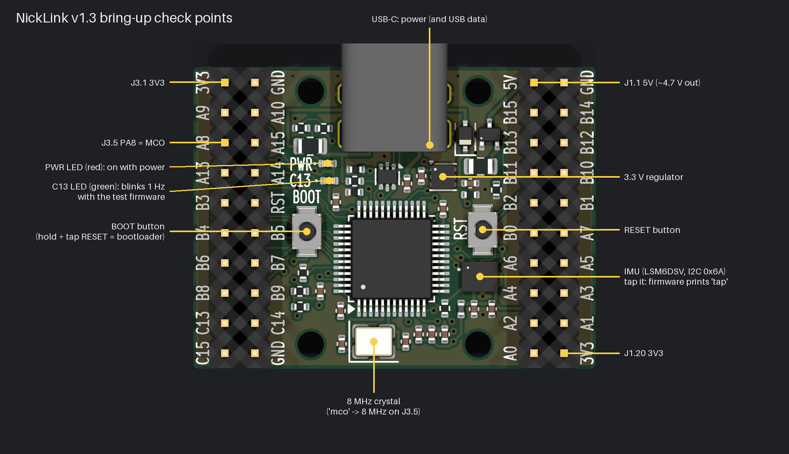
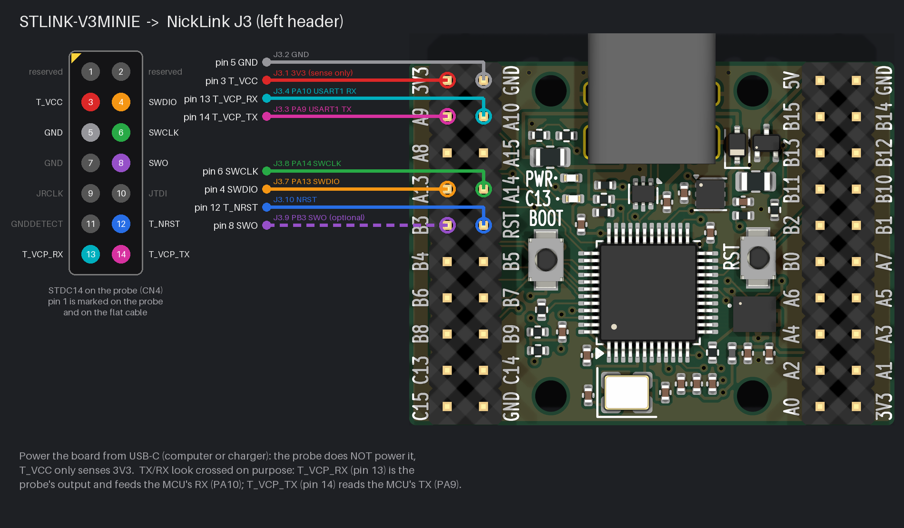

# NickLink v1.3 bring-up and board test

This takes a freshly assembled board from "just arrived" to "every part checked", in about 15 minutes. You need:

- The board, and a USB-C cable to a computer (or a USB charger) for power.
- An **STLINK-V3MINIE** with its STDC14 flat cable. The cable ends in a 1.27 mm socket, so you also need a way onto the board's 2.54 mm header: an STDC14-to-2.54 mm adapter board (Waveshare sells one with the probe), or 1.27-to-2.54 mm jumper wires.
- A serial terminal: PuTTY, the Arduino serial monitor, `screen`, or `python -m serial.tools.miniterm`.
- Optional: a multimeter, a few jumper wires, and an LED with a 1 kΩ resistor for probing pins.

The test program is [`firmware/`](../firmware/): a bare-metal bring-up firmware for this exact pinout. A prebuilt image is in [`firmware/prebuilt/`](../firmware/prebuilt/), so no toolchain is needed. It talks over USART1, which reaches your computer through the ST-Link's built-in virtual COM port, so one probe both flashes the board and shows the console.



## 1. Before power

Look the board over for solder bridges, especially at the USB-C pins, the IMU (the small square chip right of the MCU) and the MCU's pins.

With a meter on resistance, check that none of these pairs is a dead short (under 10 Ω):

| Between | Expect |
|---|---|
| J3.1 (3V3) and J3.2 (GND) | Not a short. It reads low at first while the capacitors charge, then rises. |
| J1.1 (5V) and J1.2 (GND) | Not a short |

## 2. First power

Plug USB-C into a computer.

- The **red PWR LED** comes on.
- **J3.1 / J1.20 (3V3)** reads 3.23–3.37 V.
- **J1.1 (5V)** reads about 4.6–4.8 V.
- Unplug, flip the USB-C plug over and plug in again. The LED should light in both orientations.

A brand-new STM32 has no program, so it will not enumerate. The D+ pull-up is hard-wired from VBUS (R2 2.2 kΩ and R11 4.7 kΩ), so the computer still sees a USB device as soon as the cable is plugged in. USB data needs firmware that speaks USB. The test firmware in this guide holds D+ low and keeps USB off.

## 3. Wire the ST-Link



| Wire | STLINK-V3MINIE (STDC14 / CN4) | NickLink | Signal |
|---|---|---|---|
| Red | pin 3 T_VCC | J3.1 | 3V3 (the probe only *senses* it) |
| Grey | pin 5 GND | J3.2 | GND |
| Orange | pin 4 T_SWDIO | J3.7 | PA13 SWDIO |
| Green | pin 6 T_SWCLK | J3.8 | PA14 SWCLK |
| Blue | pin 12 T_NRST | J3.10 | NRST |
| Cyan | pin 13 T_VCP_RX | J3.4 | PA10, USART1 RX |
| Magenta | pin 14 T_VCP_TX | J3.3 | PA9, USART1 TX |
| Purple, optional | pin 8 T_SWO | J3.9 | PB3 SWO, for SWV trace only |

- **The probe does not power the board.** Keep the board on USB-C (or 5 V on J1.1) the whole time. T_VCC tells the probe the target's voltage; it supplies nothing.
- **TX and RX are not a mistake.** ST names the VCP pins from the target's side. In UM2910, pin 13 T_VCP_RX is a probe *output* that drives the MCU's RX (PA10), and pin 14 T_VCP_TX is a probe *input* that reads the MCU's TX (PA9).
- **STDC14 pin 1** is marked on the probe and on the cable. Odd pins are in one row and even pins in the other.
- J3 pin 1 is the top-left pin, labelled `3V3`, with the USB-C connector at the top. Odd pins are the outer column, along the board edge.

All the SWD, serial and reset signals are on J3, so one header does everything.

## 4. Flash the test firmware

Use any one of these, with the board powered and the ST-Link plugged into your computer.

**STM32CubeProgrammer (GUI, Windows/macOS/Linux):**
1. Select ST-LINK, port SWD, mode **Under reset**, then **Connect**. "Under reset" uses the NRST wire and works even if the chip is running something that disables SWD.
2. Open `firmware/prebuilt/nicklink-test.hex`, click **Download**, then **Disconnect**. The board starts on its own.

**STM32CubeProgrammer CLI:**
```sh
STM32_Programmer_CLI -c port=SWD mode=UR -w firmware/prebuilt/nicklink-test.hex -v -rst
```

**OpenOCD** (0.12 or newer):
```sh
openocd -f interface/stlink.cfg -f target/stm32f1x.cfg \
  -c "program firmware/prebuilt/nicklink-test.hex verify reset exit"
```

**stlink tools** (1.8 or newer):
```sh
st-flash --reset write firmware/prebuilt/nicklink-test.bin 0x08000000
```

**To build it yourself:** `cd firmware && make` (or `make DOCKER=1` without an ARM toolchain). Then flash `firmware/build/nicklink-test.hex`.

If the tool reports an unknown device ID or refuses the chip, the STM32 may be a clone. For OpenOCD, add `-c "set CPUTAPID 0"` before the target `-f`. CubeProgrammer may also ask to update the ST-Link's own firmware first; let it.

## 5. Open the console

The ST-Link shows up as a serial port: **"STMicroelectronics STLink Virtual COM Port"** on Windows (a `COMx` port), `/dev/ttyACM0` on Linux, or `/dev/cu.usbmodem*` on macOS. Open it at **115200 baud, 8N1**, then press the board's **RESET** button. You should see lines like these:

```
NickLink v1.3 board test, SYSCLK 72000000 Hz
clock: HSE 8 MHz -> PLL x9 = 72 MHz (APB1 36 MHz, ADC 12 MHz, USB 48 MHz), CSS on
RCC_CFGR 0x001D840A, PVD 2.9 V: VDD ok, not from Standby
reset cause: NRST pin (RESET button) (RCC_CSR 0x...)
boot: flash aliased at 0x0 (BOOT0 was low); BOOT1/PB2 reads 0 (10k pull-down, want 0)
flash size reg 64 KB, UID ...        (many chips report 128 KB)
IMU: WHO_AM_I = 0x70 OK (LSM6DSV family)
IMU: 480 Hz, +-2 g, +-2000 dps; tap/double-tap/wake-up -> INT1 -> PA0 (EXTI0 rising)
type 'help'
>
```

Type `help` to list the commands. [`firmware/README.md`](../firmware/README.md) documents each one.

## 6. Test checklist

Work down the list; each line tests one part of the board.

| # | Part | Do this | Pass when |
|---|---|---|---|
| 1 | Power, 3V3 regulator | Steps 2 and 5 | PWR LED on, 3V3 in range, `VDD ok` in the banner |
| 2 | MCU + SWD | Step 4 | Flash and verify succeed |
| 3 | 8 MHz crystal | Read the banner `clock:` line | `HSE 8 MHz -> PLL x9 = 72 MHz` and `SYSCLK 72000000`. A dead crystal shows `64 MHz` / HSI instead. |
| 3b | Crystal accuracy (optional) | `mco`, then put a frequency counter or scope on **J3.5** | 8.000 MHz within about ±30 ppm (±240 Hz). `mco off` stops it. |
| 4 | User LED (green, PC13) | Watch it | Blinks once a second |
| 5 | RESET button | Press it | The banner reprints with `reset cause: NRST pin (RESET button)` |
| 6 | BOOT button | Hold **BOOT**, tap **RESET**, release BOOT | The LED stops blinking and the console goes quiet: the ROM bootloader is running. Tap RESET again and the test firmware comes back. |
| 7 | IMU on I2C | `i2cscan` | Only `0x6A` is found. The banner showed `WHO_AM_I = 0x70`. |
| 8 | IMU data | Lay the board flat, run `imu` | Accel about `0 0 1000` mg (±60), gyro within a few dps of 0, temperature near room temperature. Flip it upside down: Z reads about −1000. |
| 9 | IMU interrupt, INT1 → A0 | Tap the board near the IMU, double-tap it, give it a shake | Prints `tap`, `double-tap` and `wake`. Thresholds are `#define`s at the top of `firmware/src/main.c` if it is too eager or too deaf. |
| 10 | Every header GPIO (outputs, shorts) | Unplug anything else from the headers, run `walk`. Optionally follow along with an LED + 1 kΩ to GND on each pin as it is named. | Ends with `walk done: N pins, 0 faults`. Any `FAIL` names the pin and whether it looks shorted to GND, 3V3 or another pin. |
| 11 | Every header GPIO (inputs) | `mon`, then touch a jumper from 3V3 (J3.1) to each pin in turn | Each touch prints `mon: J1.x PAy=1`, then `=0` on release. B6/B7 sit at 1 (I2C pull-ups). |
| 12 | ADC | `adc`, then jumper A1 (J1.18) to 3V3 and run `adc` again | VDDA about 3300 mV. A1 reads about 3300 mV with the jumper. A0 reads about 0 (it has 10 kΩ to the IMU's INT1). |
| 13 | Standby + wake on A0 | `standby`, wait a second, then tap the board | The board restarts, and the banner says `woke from Standby`. RESET also wakes it. |
| 14 | USB-C, both orientations | Done in step 2 | LED on both ways. A USB data test needs firmware with USB support; this test firmware deliberately keeps USB off (D+ held low). |

Two pin groups are never walked:
- **J3.3/J3.4 (USART1):** the console runs over them, so working output already proves them.
- **J3.7/J3.8 (SWD):** flashing proves them. `walk all` includes them, but disables the debugger until the next reset.

Record anything odd, especially the crystal frequency, any `FAIL` line, and IMU readings that look wrong. Those are the open items in [`REVIEW.md`](REVIEW.md).

## Troubleshooting

| Symptom | Check |
|---|---|
| Programmer can't connect | Board powered from USB-C? GND wired? T_VCC to J3.1 (the probe reads the target voltage from it; 0 V there blocks the connection)? Try mode **Under reset**, or lower the SWD speed to 1 MHz. |
| Programs fine but the console is silent | Right COM port and 115200 baud? Press RESET. Check that the cyan wire goes to J3.4 and the magenta to J3.3. If they were swapped, swap them (harmless). |
| Banner says HSI / 64 MHz | Crystal Y1 or its 15 pF caps (C10/C11) are not oscillating. Check their soldering. The board still works on the internal oscillator, but USB needs the crystal. |
| `IMU: no ACK at 0x6A` | IMU solder joints (an LGA, inspect under magnification). Check that R7/R9 (I2C pull-ups) are fitted. Also check that nothing on J3.13/J3.14 (B6/B7) is pulling the bus low. |
| `walk` reports `FAIL ... follows ...` | Solder bridge between the two named pins, at the header or at the MCU |
| Green LED solid on, no console | The firmware hard-faulted. Re-flash, then press RESET. |
